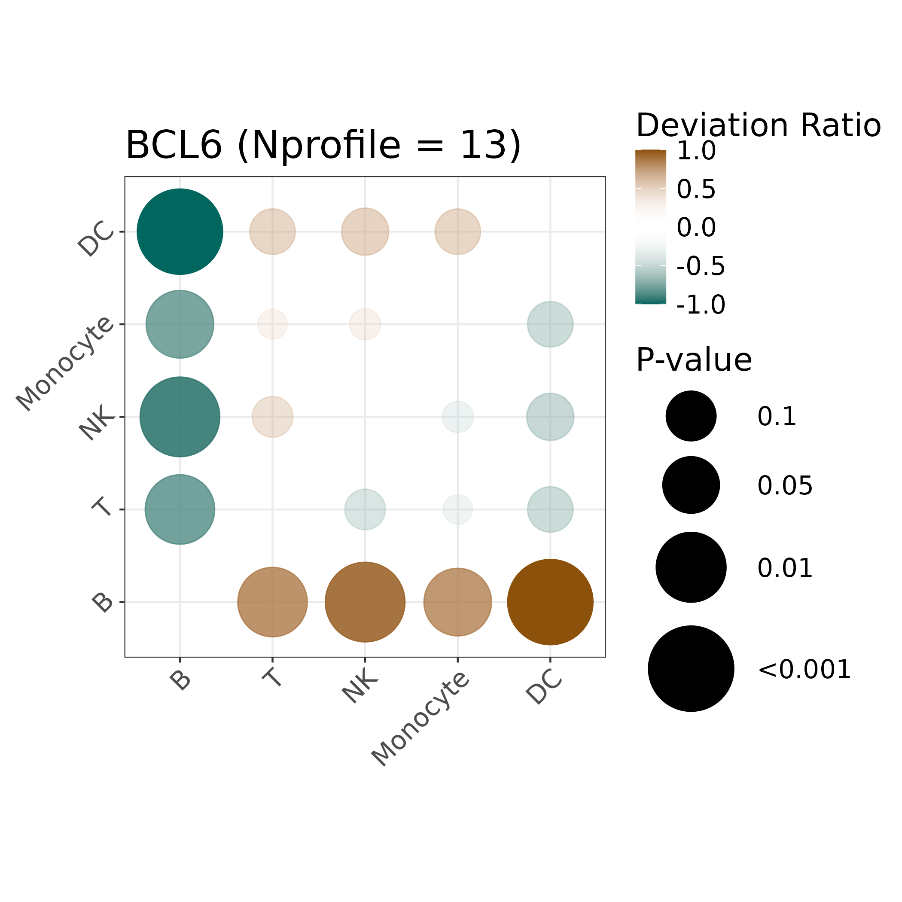
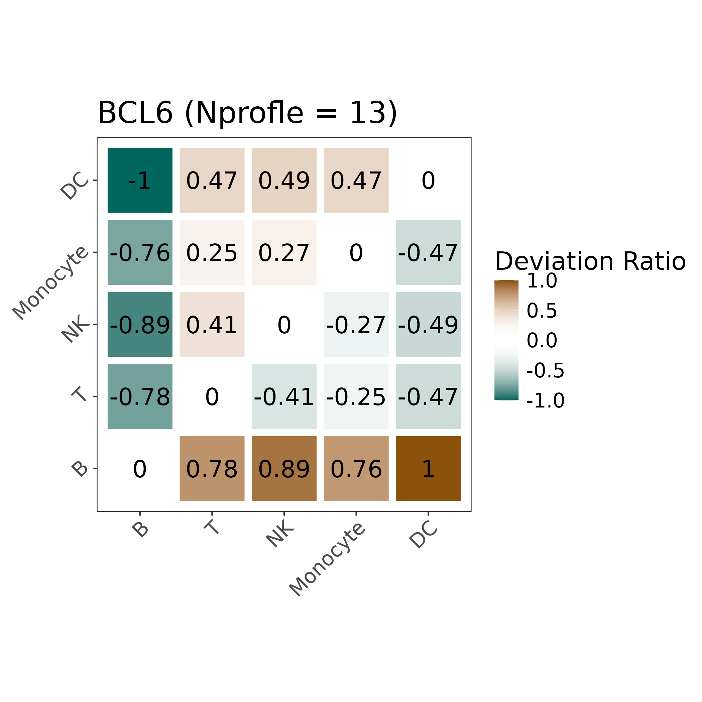
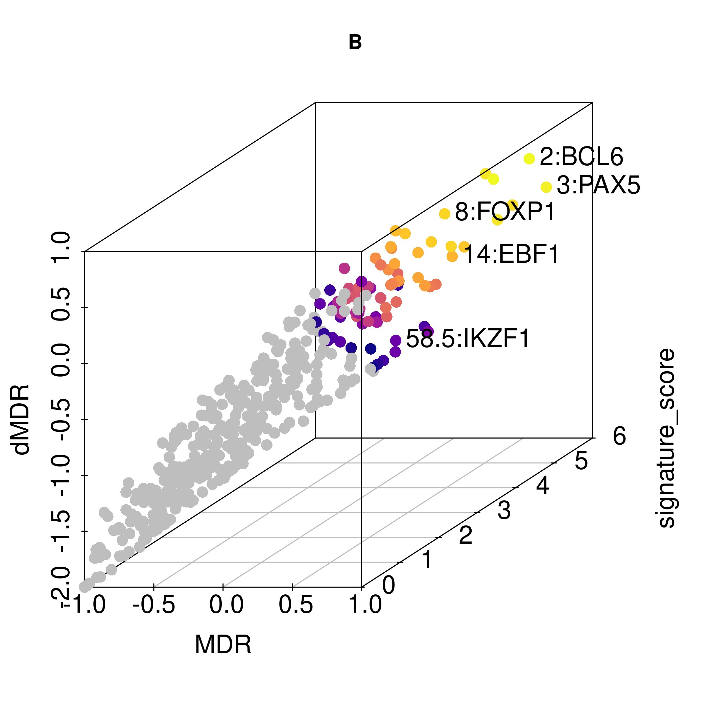

* Analysis results and visualizations shown in this tutorial are just for demonstration. They may be different from those generated on your end.

## 1. Load Bart2 python module

Once initialization is done, the user needs to load the created virtual environment to import BART2 module. This step is necessary for BARTsc to function.

```R
library("BARTsc")

load_bart2()
```

> bart2 has been loaded successfully and is now ready for use!

## 2. Prepare input data

Essential input data for scMultiomics data analysis includes

1. Count matrix: A gene by cell read count matrix, it is recommended to be a sparse Matrix.
2. Count matrix: A peak by cell read count matrix, it is recommended to be a sparse Matrix.
3. Cell type label vector: A vector of cell types, with cell ids as names. Vector length should be as same as the cell number of the count matrix.
4. Peak list: A bed-file-like data frame
5. Cell type label vector: A vector of cell types, with cell ids as names. Vector length should be as same as the cell number of the count matrix.

The following code is used to load built-in test data. Users can take this as a reference to prepare input data.

```R
# scRNA-seq count matrix
data(pbmc_rna_cnt)

#  scATAC-seq count matrix and Peak list
data(pbmc_atac_cnt)
data(pbmc_peaks)

# cell types label vector
data(label_lv1)
```

```R
pbmc_rna_cnt[1:5, 1:3]
```

> 5 x 3 sparse Matrix of class "dgCMatrix"
>          TGTGGCCAGCGAGTAA.1 TAAGGCTTCAGGGCCT.1 CATAACGGTTGCAATG.1
> MIR1302-2HG                  .                  .                  .
> FAM138A                      .                  .                  .
> OR4F5                        .                  .                  .
> AL627309.1                   .                  .                  .
> AL627309.3                   .                  .                  .

```
head(label_lv1)
```

> TGTGGCCAGCGAGTAA.1 TAAGGCTTCAGGGCCT.1 CATAACGGTTGCAATG.1 AAGTGTTGTGAGACTC.1
>            "NK"         "Monocyte"         "Monocyte"         "Monocyte"
> GGCTAGTGTACGCGCA.1 ACGAATCTCGGGCCAT.1
>      "Monocyte"               "NK"

## 

## 4. Create BARTsc object and data normalization

The user then uses data prepared to create a BARTsc object which will be used for BARTsc analysis and downstream analysis.

```R
bimodal_proj <- bartsc(
	name = "pbmc", genome = "hg38",
	cell_types_used = c("B", "T", "NK", "Monocyte", "DC"),
	label = label_lv1,
	RNA_cnt_matrix = pbmc_rna_cnt,
    ATAC_cnt_matrix = pbmc_atac_cnt,
	peaks = pbmc_peaks
)

bimodal_proj <- normalize_RNA(bimodal_proj)
ATAC_proj <- normalize_ATAC(ATAC_proj)
```

## 5. Feature extraction

BARTsc input into BART two types of features:

1. Signature features: the features that are differentially expressed in one cell type other than other cell types (e.g. marker genes)
2. Pairwise differentially expressed features: features that are differentially expressed between a pair of cell types.

Quickly identify these features using built-in functions.

```R
# find cell type signature genes (DEGs)
RNA_proj <- find_signature_genes(
    RNA_proj,
    min.pct = 0.1,
    min.diff.pct = -Inf,
    log2fc.thr = 1,
    pval.thr = NULL,
    padj.thr = 0.05,
    auc.thr = 0,
    max.cells.per.ident = Inf
)

# find pairwise DEG
RNA_proj <- find_pairwise_deg(
    RNA_proj,
    min.pct = 0.1,
    min.diff.pct = -Inf,
    log2fc.thr = 1,
    pval.thr = NULL,
    padj.thr = 0.05,
    auc.thr = 0,
    max.cells.per.ident = Inf
)

# find cell type signature peaks (DARs)
ATAC_proj <- find_signature_peaks(
       ATAC_proj,
       min.pct = 0.1,
       min.diff.pct = -Inf,
       log2fc.thr = 0.25,
       pval.thr = NULL,
       padj.thr = 0.05,
       auc.thr = 0.5,
       max.cells.per.ident = Inf
     )

# find pairwise DAR
ATAC_proj <- find_pairwise_dar(
    ATAC_proj,
    min.pct = 0.1,
    min.diff.pct = -Inf,
    log2fc.thr = 0.25,
    pval.thr = NULL,
    padj.thr = 0.05,
    auc.thr = 0.5,
    max.cells.per.ident = Inf
)
```

## 6. Cell type signature analysis

Cell type signature analysis uses signature features identified in the [feature extraction](#Feature extraction) section to infer transcription regulators that are more likely to contribute to cell type signature expression.

### Run analysis

Set `mc.cores` for multi-thread computation. A minimum of 12 GB of memory per core is recommended. For the following case, A minimum of 72 GB is recommended.

```R
options("mc.cores" = 6)

# Cell type signature analysis
bimodal_proj <- run_signature_bimodal(bimodal_proj)
```

### Check results

BART comprehensively consider wilcoxon rank sum test statistics (score), zscore and max_auc to rank TFs. `rank_avg_z_p_a_irwinhall_pvalue` is the final p value.

```R
results_list <- get_result(bimodal_proj, analysis = "cell type signature", mod = "bimodal")

head(results_list[["B"]])
```

>    TF avg_auc    score pvalue zscore max_auc rank_avg_z_p_a
>
> 1   PAX5   0.592 4.636374  0.000  2.500   0.685     0.01258170
> 2   BCL6   0.565 3.848920  0.000  2.304   0.726     0.01437908
> 3  MEF2B   0.643 4.040240  0.000  2.110   0.779     0.02049020
> 4   BCOR   0.562 2.787129  0.003  2.714   0.627     0.02444444
> 5 TCF7L1   0.523 2.857074  0.002  2.339   0.654     0.02444444
> 6  STAG1   0.549 9.890169  0.000  2.274   0.589     0.03307190
>   rank_avg_z_p_a_irwinhall_pvalue
> 1                    8.962526e-06
> 2                    1.337846e-05
> 3                    3.871247e-05
> 4                    6.572840e-05
> 5                    6.572840e-05
> 6                    1.627758e-04

## 7. Cross-cell-type analysis

Cross-cell-type analysis uses pairwise differentially expressed features identified in the  [feature extraction](#Feature extraction) section to quantify the relative activity of a given transcription regulator across different cell types. For each transcription regulator in database, BARTsc output a deviation ratio matrix demonstrating whether and to what extent the given transcription regulator is more active between a pair of cell types. Corresponding p values are calculated using Wilcoxon signed-rank test. 

### Run analysis

```R
options("mc.cores" = 6)

# Cross-cell-type analysis
bimodal_proj <- calc_crossCT_auc_bimodal(bimodal_proj)
bimodal_proj <- crossCT_test(bimodal_proj, mod = "bimodal")
```

### Check results

`get_result` returns a list of DR (deviation ratio) matrix. For an entry of a DR matrix, it represents whether the given transcription regulator is more active in the row cell type (> 0) or the column cell type (< 0). Deviation ratio ranges from -1 to 1. For example, in the DR matrix of transcription regulator BCL6, the entry of 1st row and 2nd column is 0.7802198, demonstrating that BCL6 is more active in B cells than T cells. Besides, we observed that the all the entries of the first row is greater than or equal to 0, which suggests BCL6 is more active in B cells in the comparisons between B cells and any other cell types in this dataset. 

```R
results_list <- get_result(bimodal_proj, analysis = "cross-cell-type", mod = "bimodal")

results_list[["BCL6"]]
```

> ​               B         T         NK   Monocyte         DC
>
> B         0.0000000 0.7802198  0.8901099  0.7582418  1.0000000
> T        -0.7802198 0.0000000 -0.4065934 -0.2527473 -0.4725275
> NK       -0.8901099 0.4065934  0.0000000 -0.2747253 -0.4945055
> Monocyte -0.7582418 0.2527473  0.2747253  0.0000000 -0.4725275
> DC       -1.0000000 0.4725275  0.4945055  0.4725275  0.0000000

### Visualization

```R
dot_plot(bimodal_proj, mod = "bimodal", tf = "BCL6", max_dot_size = 22)
```



```R
deviation_heatmap(bimodal_proj, mod = "bimodal", tf = "BCL6", tile_fontsize = 6)
```



## 8. Identify cell type key regulators

BARTsc identifies key regulators for a given cell types by comprehensively considering three factors: 1) Contribution to signature expression, 2) relative activity across all the cell types and 3) the uniqueness of a given transcription regulator. These three factors are quantified by signature score, MDR (mean deviation ratio) and dMDR (differential MDR) respectively. Final rank is determined by the mean rank of above indices. Final pvalues are calculated based on Irvin-Hall distribution. 

Users can set parameter `min.N.profile` to exclude TF with very few reference datasets from analysis to achieve a higher robustness.

### Run analysis

```R
bimodal_proj <- find_key_regulators(bimodal_proj, mod = "bimodal", min.N.profile = 1)
```

### Check results

```R
results_list <- get_result(bimodal_proj, analysis = "Key regs ident", mod = "bimodal")

head(results_list[["B"]])
```

>   TF signature_score       MDR      dMDR aggr.value final_rank final_pvalue
>
> 1 STAG1        3.788410 0.9000699 0.8060797    5.00000          1 7.225017e-06
> 2  BCL6        4.873594 0.8571429 0.7472527    6.00000          2 1.248483e-05
> 3  PAX5        5.047570 0.9318182 0.4545455   10.33333          3 6.377496e-05
> 4  BCOR        4.182247 0.7333333 0.7666667   10.50000          4 6.691089e-05
> 5  CD74        3.532120 1.0000000 0.5000000   10.83333          5 7.348779e-05
> 6 MEF2B        4.412149 0.8636364 0.4363636   13.66667          6 1.475423e-04

### Visualization

```R
key_regulator_scatter(bimodal_proj, mod = "bimodal", cell_type = "B", tfs_labeled = c("EBF1", "BCL6", "PAX5", "FOXP1", "IKZF1"))
```


